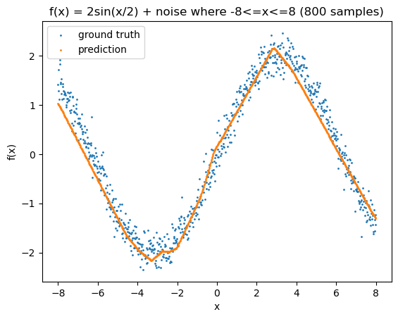

# MatProp
MatProp is a small PyTorch-like backpropagation engine and neural network 
framework defined with autograd-supported matrix operations.

### Installation
As simple as it gets!

```bash
pip install matprop
```

### Neural Network Usage
The following shows the fit and training code of a fully-connected
neural network on a sine wave, full example in nn_demo.ipynb



```python
model = MLP(n_inputs=1, layer_outputs=[12, 12, 1])
lr = 0.01
loss_hist = []

for epoch in tqdm(range(500)):
    # forward pass
    preds = [model(x) for x in Xs]
    loss = mse_loss(preds, ys)

    # backward pass
    model.zero_grad()
    loss.backward()

    # update
    for p in model.parameters():
        p.data -= lr * p.grad

    loss_hist.append(loss.data.squeeze())
```

### Matrix Usage
The following shows some MatProp Matrix operations with full autograd support,
full example and outputs in matrix_demo.ipynb
```python
A = Matrix([[1., 2.]])

B = Matrix([[3., 2.],
            [2., 1.]])

AB = A @ B
AB2 = AB ** 3
Relu = AB2.relu()
Sum = Relu.sum()

Sum.backward()
```

### Running Tests
The test suite tests agreement between MatProp Matrix operations and
PyTorch Tensor operations, both in the foward and backward passes.
To run them, simply run `python -m pytest` in the base project
directory. (PyTorch needed obviously)

### Inspiration
MatProp was heavily inspired by [Andrej Kaparthy's Micrograd](https://github.com/karpathy/micrograd)
and his [YouTube video explaining it in detail](https://youtu.be/VMj-3S1tku0).
However, MatProp is expanded and shifted in scope by being defined
with matrix operations rather than scalar operations. I highly
recommend giving his video a watch, it is the single best explanation
on how backprop works I have seen.